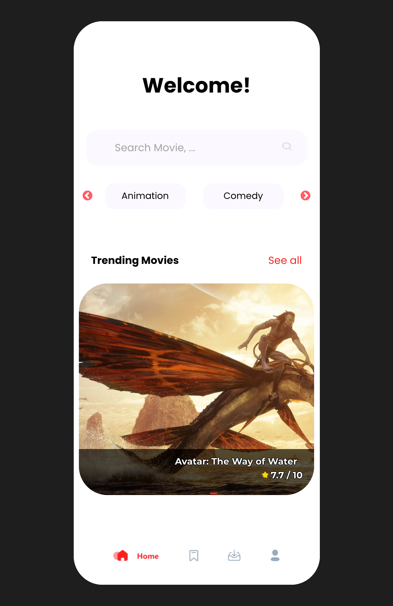
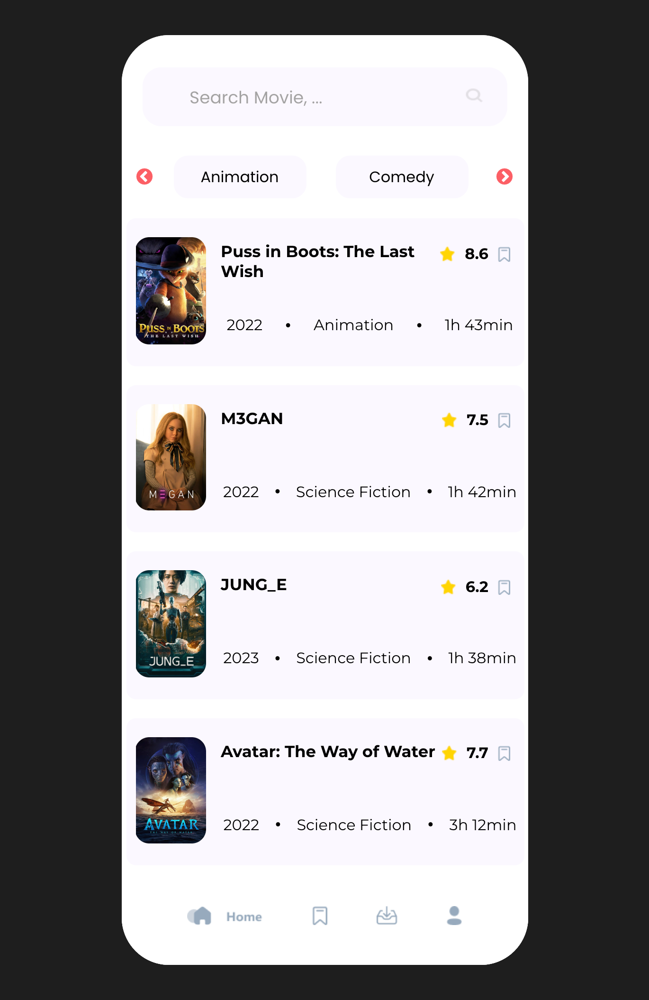
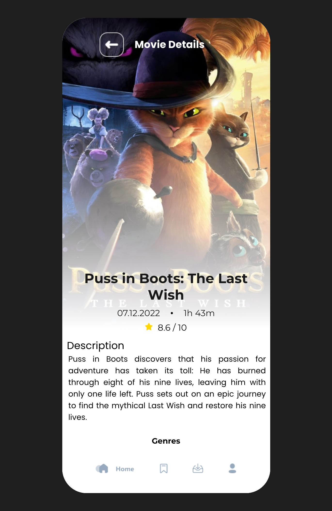

## React – Movie Database - Abschlussprojekt

## 🎓 Aufgabe

Auf der Seite .MOV werden alle möglichen Filme in einem schönen Raster angezeigt!
 
Bei Klick auf ein Plakat kommt Ihr auf eine Detailseite und erhaltet alle Informationen, die Ihr Euch wünschen könnt.

Viel Spaß beim Suchen und Anschauen! 🎬

## 📸 Screenshots Aufgabe

Zum Projekt -> https://moviezmov.netlify.app/

<h3 align="left">Languages and Tools:</h3>

 
 
 

